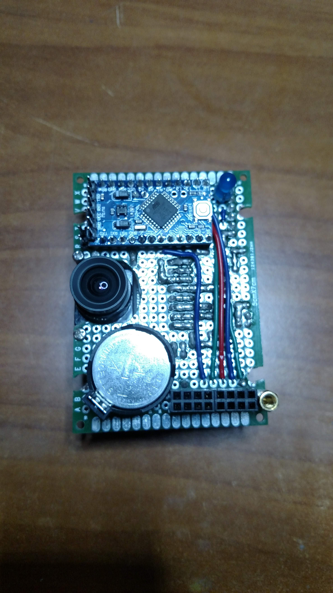
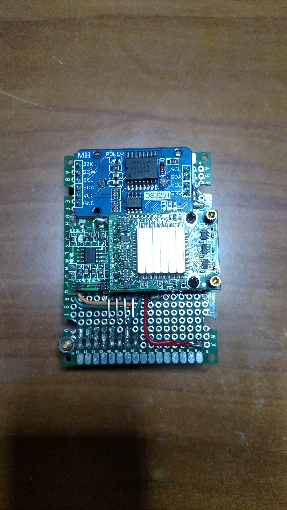
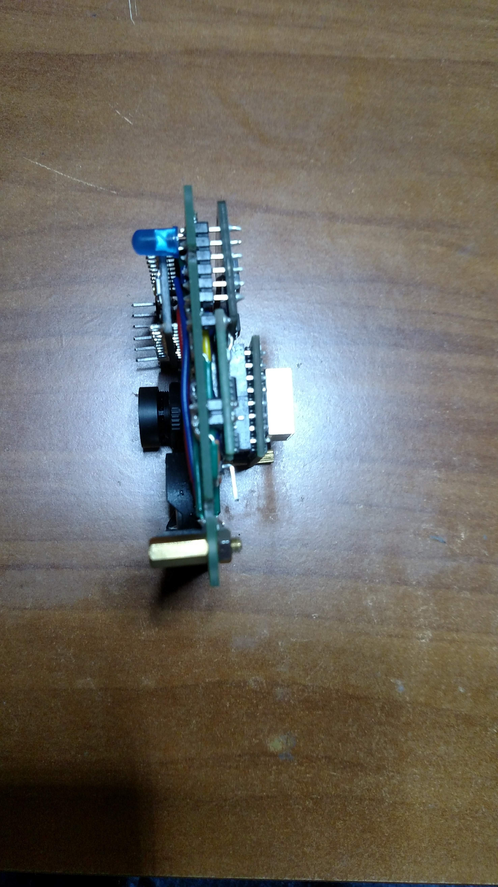
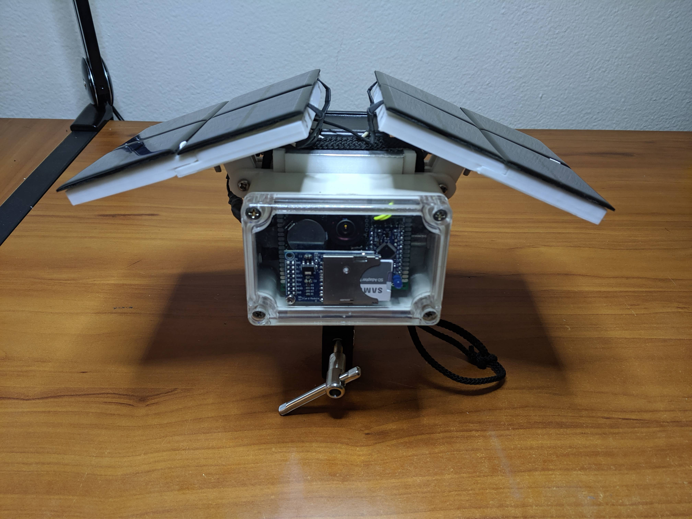
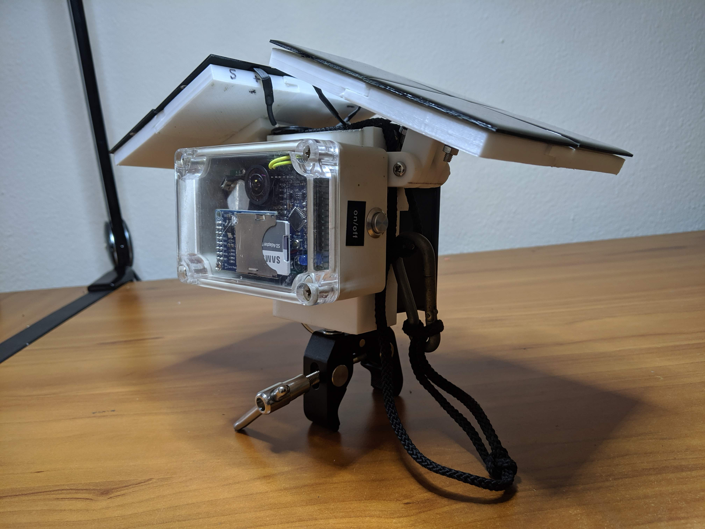
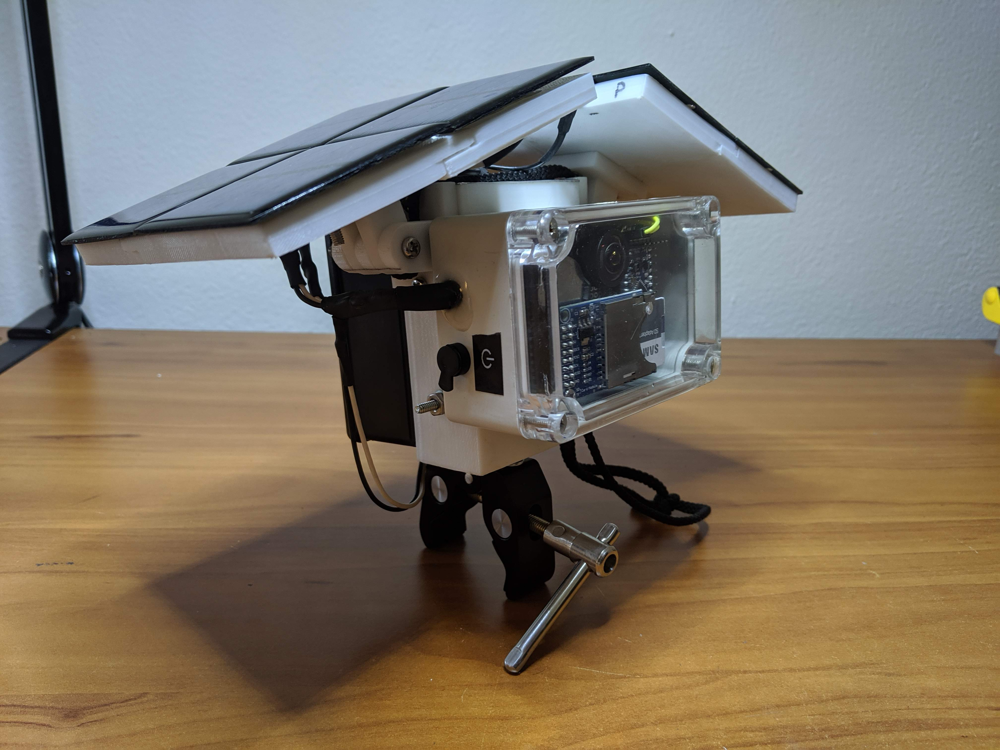

# Description

The SailCam is an attempt to put an entirly self sufficent camera on a sail boat. The camera mounts to the stern rail of the boat and does not require an external power source. It powers itself entirely from solar energy and a battery pack.

The current design sacrifices elegance for modularity and brute force functionality. It is divided into components that can be individually detached and redesigned if needed. This allows for design iteration over a testing period. A new design will be created after core functionality is refined. 

# Video Results

All timelapse videos processed from the pictures taken by the SailCam can be found [here](https://photos.app.goo.gl/NxdoZSaHQNxRXsou5)

## Port Huron to Mackinac Race 2019
https://youtu.be/PzzFX_mOYdo

# Specifications

Battery Capacity: 33600 mAh  
Solar Panel Output (Per panel): 4V 400mA  
Image Capture Interval: 20 seconds  
Storage Capacity: up to 32 GB  

# Parts
Camera Module: ArduCAM Mini 5MP Plus OV5642  
CPU: Arduino Mini Pro ATMega328 16MHz 3.3V  
SD Card Module: LC Studio SPI SD Card Socket Reader/Writer  
Real Time Clock: DS3231  
Power Controller: TP4056  
Batteries: 14500 3.7V 2800mAH Lithium Li-ion

# Build
## Main Board
Front of the main board without the SD card module attached 

Back of the main board 

Side view 

## Final Construction
Final Construction for the 2019 Mackinac Race. A lot of the chassis was 3D printed. Originally the camera module was designed to be in potrait mode, but after testing, it was changed to landscape.
 

 
 
 